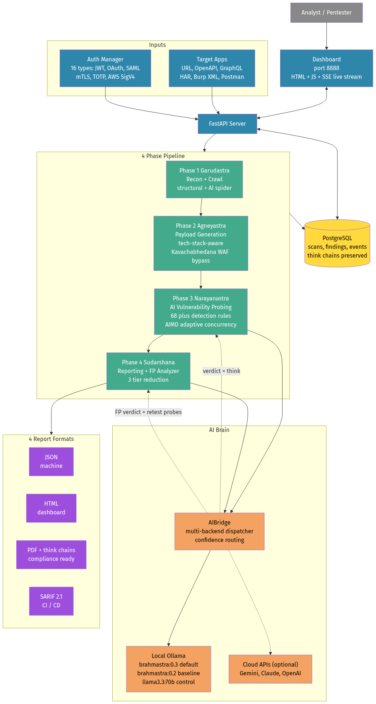

# BRAHMASTRA DAST

**A specialized AI-powered Dynamic Application Security Testing (DAST) scanner that uses a fine-tuned 32B reasoning LLM to judge findings, cutting false positives by ~24 percentage points compared to generic models.**

[](https://github.com/krishnareddypadala/brahmastra-dast/actions/workflows/gitleaks.yml)
[](https://opensource.org/licenses/Apache-2.0)
[](https://www.python.org/downloads/)
[](https://huggingface.co/Krishnapadala55/brahmastra-0.3)
[](https://huggingface.co/datasets/Krishnapadala55/brahmastra-benchmark)



---

## Why BRAHMASTRA DAST?

Modern DAST scanners are great at finding things and terrible at judging them. Industry baseline: **about 80% of DAST findings are false positives**, which means hundreds of analyst-hours burned on triage per scan.

BRAHMASTRA DAST plugs a domain-specific 32B reasoning LLM ([BRAHMASTRA 0.3](https://huggingface.co/Krishnapadala55/brahmastra-0.3)) into the scanner's findings pipeline. The model:

- Judges each ambiguous finding as `confirmed`, `false_positive`, or `uncertain`
- Attaches a `<think>...</think>` reasoning chain to every verdict (auditable, defensible to compliance review)
- Generates retest probes when a finding needs more evidence
- Runs entirely on-prem, $0 per scan, no data leaves your perimeter

On the [public 6-suite benchmark](https://huggingface.co/datasets/Krishnapadala55/brahmastra-benchmark), the BRAHMASTRA 0.3 model beats a strong 32B baseline by **+23.9 percentage points** on DAST false-positive accuracy (p < 0.001).

---

## Capabilities

| Area | What's in the box |
|------|-------------------|
| **4-phase pipeline** | Garudastra (recon + crawl) -> Agneyastra (payload generation) -> Narayanastra (AI-powered probing) -> Sudarshana (reporting + FP analysis) |
| **Detection rules** | 68+ active and passive rules covering OWASP Top 10 and beyond |
| **Authentication** | 16 types: form login, JWT, OAuth 2.0, OpenID Connect, SAML, NTLM/Kerberos, mTLS, AWS SigV4, TOTP MFA, custom headers, etc. |
| **Input formats** | 8 formats: URL, OpenAPI 3.x, Swagger 2, WSDL, Postman, GraphQL SDL, HAR, Burp XML |
| **Adaptive concurrency** | AIMD (TCP-inspired) congestion control: polite -> balanced -> aggressive presets |
| **AI backend selection** | Local Ollama (default), Gemini, Claude, OpenAI -- all pluggable via `AIBridge` |
| **Output formats** | JSON, HTML, PDF (with `<think>` reasoning chains), SARIF 2.1 (CI/CD) |
| **Scan profiles** | full, quick, stealth, api_only, auth_only, owasp_top10, pci_dss, api_security, smart |
| **Dashboard** | Real-time SSE event stream + per-scan AI guidance chat |

---

## Quick Start

You have two equally supported deployment paths. Pick whichever matches your environment.

### Choose your path

| | **Path A: Cloud AI** | **Path B: Local AI** |
|---|---|---|
| **Time to first scan** | 10-15 min | 60-90 min |
| **GPU required?** | No | Yes (24 GB+ VRAM) |
| **Cost per scan** | $0.05 - $0.50 (per provider rates) | $0 |
| **Privacy** | scan data sent to cloud | fully on-prem |
| **AI backend** | Gemini / Claude / GPT-4o | BRAHMASTRA 0.3 (local Ollama) |
| **Free API key available?** | Yes (Google Gemini Flash) | n/a |

**Tip**: start with **Path A** to confirm the scanner works on your environment in 15 minutes; upgrade to **Path B** later for privacy and zero-cost production use. Both paths can coexist; pick per scan from the dashboard dropdown.

---

### Path A: Cloud AI (no GPU needed)

**One-line install:**

```bash
curl -fsSL https://raw.githubusercontent.com/krishnareddypadala/brahmastra-dast/main/scripts/install.sh | bash
```

Or step by step:

```bash
# 1. Install dependencies + scanner
sudo apt install -y python3 python3-venv postgresql postgresql-contrib git
git clone https://github.com/krishnareddypadala/brahmastra-dast.git
cd brahmastra-dast
python3 -m venv ~/brahmastra-env && source ~/brahmastra-env/bin/activate
pip install -r requirements.txt

# 2. Postgres
sudo systemctl start postgresql
sudo -u postgres createuser brahmastra
sudo -u postgres psql -c "ALTER USER brahmastra WITH PASSWORD 'brahmastra';"
sudo -u postgres createdb -O brahmastra brahmastra

# 3. Launch
python3 -m uvicorn server.api:app --host 0.0.0.0 --port 8888
```

Open `http://localhost:8888`, select **Gemini 2.5 Flash** (or Claude / OpenAI) in the AI Mode dropdown, paste a free [Google AI Studio](https://aistudio.google.com/apikey) key in the field that appears, and launch your first scan.

---

### Path B: Local AI (BRAHMASTRA 0.3 on Ollama)

**One-line install** (after cloning the repo):

```bash
git clone https://github.com/krishnareddypadala/brahmastra-dast.git
cd brahmastra-dast
./scripts/install-local.sh
```

Or step by step. Steps 1-3 above PLUS:

```bash
# 4. Install Ollama
curl -fsSL https://ollama.com/install.sh | sh

# 5. Pull the BRAHMASTRA 0.3 GGUF from Hugging Face (~19 GB)
pip install huggingface_hub
huggingface-cli download Krishnapadala55/brahmastra-0.3-GGUF \
  brahmastra-v3.Q4_K_M.gguf --local-dir ~/

# 6. Register the model in Ollama
cat > ~/brahmastra-v3-Modelfile <<EOF
FROM ~/brahmastra-v3.Q4_K_M.gguf
PARAMETER temperature 0.6
PARAMETER top_p 0.95
PARAMETER num_ctx 4096
SYSTEM """You are BRAHMASTRA, an elite AI-powered DAST security scanner. Use <think>...</think> to reason before each response. Be precise - only confirm vulnerabilities with clear evidence."""
EOF
ollama create brahmastra:0.3 -f ~/brahmastra-v3-Modelfile

# 7. Pre-warm (loads 19 GB into VRAM, future scans have zero cold-start)
curl -s http://localhost:11434/api/generate \
  -d '{"model":"brahmastra:0.3","prompt":"warm","keep_alive":-1,"stream":false}' > /dev/null
```

Then select **BRAHMASTRA 0.3** in the dashboard dropdown. No API key needed.

---

### Hardware requirements

| Component | Path A (Cloud) | Path B (Local) |
|-----------|----------------|----------------|
| GPU | None | RTX 3090 / 4090 (24 GB VRAM) minimum |
| RAM | 8 GB | 16 GB minimum, 32 GB recommended |
| Disk | 5 GB | 40 GB |
| Network | outbound HTTPS + target reach | outbound for model download, then offline-capable |

**Full setup guide**, including production hardening, Docker, troubleshooting, and uninstall, is in **[SETUP.md](SETUP.md)**.

---

## Architecture in one diagram

```
+----------------------+      +-----------------+
|  Dashboard (8888)    |<---->| FastAPI server  |
|  HTML + SSE          |      | server/api.py   |
+----------------------+      +-----------------+
                                       |
                                       v
+-----------------------------------------------------------+
|              ScanEngine (brahmastra/engine.py)            |
|  +---------------+ +--------------+ +------------------+  |
|  | Garudastra    | | Agneyastra   | | Narayanastra     |  |
|  | recon + crawl | | payload gen  | | AI vuln probing  |  |
|  +---------------+ +--------------+ +------------------+  |
|                                              |            |
|                                              v            |
|                                    +------------------+   |
|                                    | Sudarshana       |   |
|                                    | reports + FP     |   |
|                                    +------------------+   |
+-----------------------------------------------------------+
                |                              |
                v                              v
+-----------------------+        +---------------------------+
|  AIBridge             |        |  PostgreSQL               |
|  brahmastra/ai_bridge |        |  scans, findings, events  |
|  multi-backend        |        |  think chains preserved   |
+-----------------------+        +---------------------------+
            |
            v
+-----------------------------------------------------+
|  Ollama localhost:11434                             |
|  brahmastra:0.3 (default, on-prem)                  |
|  + Gemini / Claude / OpenAI (optional fallback)     |
+-----------------------------------------------------+
```

---

## Configuration

### AI backends

Set the AI mode in the dashboard or via API. Supported `ai_mode` values:

| Mode | Backend | Cost | Privacy |
|------|---------|------|---------|
| `brahmastra` (default) | local Ollama, `brahmastra:0.3` | $0 | on-prem |
| `brahmastra_02` | local Ollama, `brahmastra:0.2` (older baseline) | $0 | on-prem |
| `ollama_llama33` | local Ollama, `llama3.3:70b` | $0 | on-prem |
| `gemini_flash` | Google Gemini 2.5 Flash | per-token | cloud |
| `gemini_pro` | Google Gemini 2.5 Pro | per-token | cloud |
| `claude_haiku` | Anthropic Claude Haiku 4.5 | per-token | cloud |
| `claude_sonnet` | Anthropic Claude Sonnet 4 | per-token | cloud |
| `openai` | OpenAI GPT-4o-mini | per-token | cloud |
| `heuristic` | no AI; rules engine only | $0 | on-prem |
| `disabled` | skip AI step; all findings reported raw | $0 | on-prem |

API keys for cloud backends are passed per-scan via the dashboard (not stored in env vars).

### Confidence routing

The scanner only calls the AI on ambiguous findings. Threshold is per-rule (0.0 to 1.0):

- `confidence > 0.8`: auto-confirmed, no AI call (cheap, deterministic)
- `0.3 <= confidence <= 0.8`: routed to AI for judgment + retest probes
- `confidence < 0.3`: dropped

Tune via `brahmastra/engine.py` -> `CONFIDENCE_THRESHOLDS`.

---

## Project layout

```
brahmastra-dast/
├── server/                  FastAPI app
│   ├── api.py               REST + SSE endpoints
│   └── ...
├── brahmastra/              Core scanner engine
│   ├── engine.py            ScanEngine orchestrator (4 phases)
│   ├── ai_bridge.py         multi-backend AI dispatcher
│   ├── fp_analyzer.py       post-scan FP analysis with retest probes
│   ├── concurrency.py       AIMD adaptive concurrency
│   ├── garudastra/          phase 1: auth + recon + crawl
│   ├── agneyastra/          phase 2: payload generation
│   ├── narayanastra/        phase 3: AI vuln probing
│   └── sudarshana/          phase 4: reporting
├── dashboard/               HTML + JS SPA + SSE event stream
├── cli/                     command-line entry points
├── db/                      SQL migrations
├── tests/                   test suite
└── requirements.txt         Python dependencies
```

---

## Benchmark numbers

The BRAHMASTRA 0.3 model was evaluated against the v0.2 baseline on a public 6-suite benchmark. Statistically significant wins are documented at:

- Model card: <https://huggingface.co/Krishnapadala55/brahmastra-0.3>
- Benchmark dataset (anyone can reproduce): <https://huggingface.co/datasets/Krishnapadala55/brahmastra-benchmark>

Headline:

| Suite | Metric | v0.3 | v0.2 baseline | p-value |
|-------|--------|-----:|--------------:|--------:|
| A: DAST FP Judgment | F1 | **0.893** | 0.747 | **<0.001** |
| A: DAST FP Judgment | Accuracy | **88.7%** | 64.8% (+23.9pp) | **<0.001** |
| G: Reasoning Correctness | mean of 5 | **3.17** | 2.43 | **0.002** |
| F: Malicious Refusal | rate | **100%** | 65% | -- |

---

## Disclaimer

**For authorized security testing only.** BRAHMASTRA DAST sends real attack payloads to target applications. Running it against any system you do not own or have explicit written permission to test is illegal in most jurisdictions and unethical in all of them.

You are responsible for ensuring your use of this tool complies with applicable laws, contracts, scope agreements, and organizational policies. The BRAHMASTRA 0.3 model is alignment-trained to refuse malicious-target requests at the model layer, but the scanner itself cannot validate authorization scope on your behalf.

By using this software you accept full responsibility for how it is used.

---

## Citation

If you use BRAHMASTRA DAST or the underlying model in research, please cite:

```bibtex
@misc{padala2026brahmastradast,
  author       = {Padala, Krishna},
  title        = {BRAHMASTRA DAST: An AI-Augmented Dynamic Application Security Testing Scanner},
  year         = {2026},
  publisher    = {GitHub},
  howpublished = {\url{https://github.com/krishnareddypadala/brahmastra-dast}}
}

@misc{padala2026brahmastra03,
  author       = {Padala, Krishna},
  title        = {BRAHMASTRA v0.3: A Specialized 32B Reasoning LLM for Web Application Security Testing},
  year         = {2026},
  publisher    = {Hugging Face},
  howpublished = {\url{https://huggingface.co/Krishnapadala55/brahmastra-0.3}}
}
```

---

## License

Apache License 2.0. See [LICENSE](LICENSE) for full text.

---

## Maintainer

Krishna Padala -- <psmkreddy255@gmail.com>

Companion artefacts:
- BRAHMASTRA 0.3 model: <https://huggingface.co/Krishnapadala55/brahmastra-0.3>
- BRAHMASTRA 0.3 GGUF: <https://huggingface.co/Krishnapadala55/brahmastra-0.3-GGUF>
- BRAHMASTRA 0.3 LoRA: <https://huggingface.co/Krishnapadala55/brahmastra-0.3-lora>
- Benchmark dataset: <https://huggingface.co/datasets/Krishnapadala55/brahmastra-benchmark>
